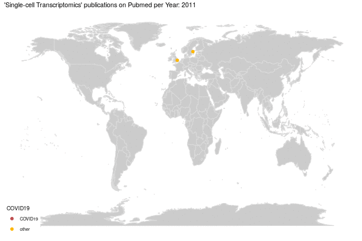

# Geospatial_PubMed_Visualization
## Retrieve information on publications from PubMed and visualize the address of the first/last/all authors on a world map.

This repository holds code that serves to automatically download and process publication records on a given query from PubMed using the [easyPubMed](https://cran.r-project.org/web/packages/easyPubMed/vignettes/getting_started_with_easyPubMed.html).

Subsequently, the addresses of the first/last/all authors are mutated into geospatial coordinates using the [ggmap](https://journal.r-project.org/archive/2013-1/kahle-wickham.pdf) package, which interacts with the Google Cloud Platform Geocoding API to extract longitude and latitude from Google maps, based on a location query. This requires a Google Cloud Platform account linked to a credit card.

Finally, the resulting information is visualized on a world map, either as static plots or animated gifs of time-resolved information.

The example presented in the code shows the spread of single-cell transcriptomics technologies across the globe during the last century.

